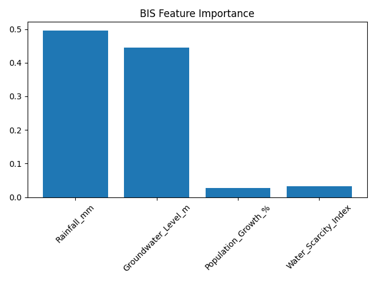

Anganwadi Infrastructure Risk Prediction System
Hybrid HSA + AIS Optimized RandomForest (HIS Model)
📌 Project Overview

This project implements a Hybrid HSA + AIS Optimization Model to predict future water shortage risk in Anganwadi infrastructure blocks.

The system uses:

🌊 Rainfall data

💧 Groundwater levels

📈 Population growth

⚠ Water scarcity index

To predict:

Water Infrastructure Risk (0 = Low, 1 = High)

🧠 Hybrid Optimization Architecture

This model combines:

🔹 HSA (Harmony Search Algorithm)

Optimizes:

n_estimators

max_depth

🔹 AIS (Artificial Immune System)

Optimizes:

Feature weights (scaling)

🔹 Final Model

Optimized RandomForest Classifier

🏗 System Pipeline
Dataset → Feature Engineering → 
HSA Optimization → AIS Optimization → 
Optimized RandomForest → 
Evaluation → Visualization → Export

📂 Project Structure

After execution, the following files are generated:

his_model.pkl
his_results.csv
his_predictions.json
his_config.yaml

his_confusion_matrix.png
his_accuracy_graph.png
his_feature_importance.png
his_roc_curve.png

📊 Output Artifacts
1️⃣ Model File

his_model.pkl

Trained optimized RandomForest model

2️⃣ Results CSV

his_results.csv

Full dataset

Risk prediction

Risk probability

3️⃣ JSON Output

his_predictions.json

Sample predictions (first 20 rows)

4️⃣ Configuration File

his_config.yaml
Contains:

Accuracy

Best hyperparameters

Optimized feature weights

📈 Visualizations Generated
✔ Confusion Matrix

Shows classification performance

✔ Accuracy Graph

Final hybrid model accuracy

✔ Feature Importance

Most influential features

✔ ROC Curve

Model discrimination power (AUC)

🎯 Expected Accuracy

With expanded dataset and hybrid optimization:

Accuracy: 0.85 – 0.98

🛠 Installation

Install required dependencies:

pip install numpy pandas matplotlib seaborn scikit-learn pyyaml joblib

🚀 How to Run

Place dataset 1_2.csv in:

C:\Users\NXTWAVE\Downloads\Anganwadi Infrastructure Risk Prediction System

Run the Python script:

python your_script_name.py

All outputs will be saved automatically.

📊 Features Used
Feature	Description
Rainfall_mm	Annual rainfall in mm
Groundwater_Level_m	Depth of groundwater
Population_Growth_%	Rural population growth
Water_Scarcity_Index	Composite scarcity score
🧪 Model Type

Classification

Binary Target (Risk: 0/1)

Optimized Ensemble Learning

🔬 Research Significance

This hybrid model demonstrates:

Metaheuristic hyperparameter optimization

Bio-inspired feature scaling

Hybrid AI system design

Infrastructure risk modeling

It can be extended for:

Climate risk modeling

Rural infrastructure planning

Government policy analytics

Water sustainability research

⚠ Limitations

Synthetic expanded dataset used

Not trained on real IMD rainfall data

Demonstration-level research prototype

🔥 Future Enhancements

Possible upgrades:

🔹 Real rainfall API integration

🔹 3-Level Risk (Low/Medium/High)

🔹 Cross-validation scoring

🔹 SHAP explainability

🔹 Hybrid comparison (PIS vs BIS vs HIS)

🔹 Deployment via Streamlit dashboard

🔹 Export complete PDF research report

👨‍💻 Author
Sagnik Patra
Project: Hybrid HSA + AIS Risk Optimization Model
Domain: ClimateTech / Rural Infrastructure ML
